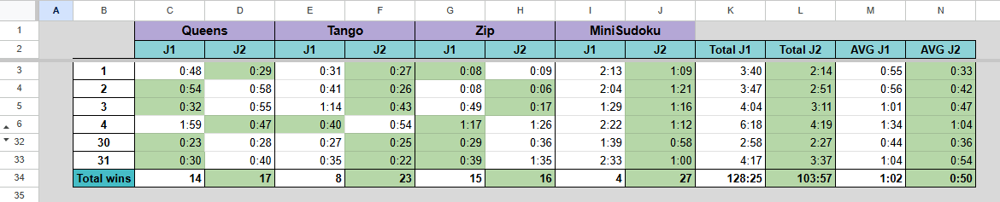
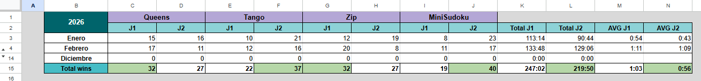
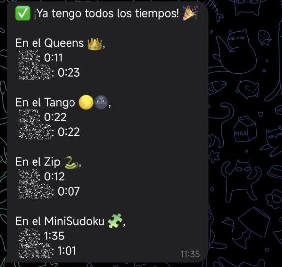

# Bot Sr.Escribano ⌚✍ <!-- omit in toc -->

Con **Sr. Escribano** puedes llevar fácilmente un historial de tus tiempos en los **juegos de LinkedIn**.
Solo tienes que enviar tu tiempo al bot por **Telegram** y él lo guardará automáticamente en una **Google Sheet** para que puedas consultarlo.

Con varios jugadores podrás comparar vuestros tiempos y ver quién es el más rápido, mandando un resumen al finalizar todos ellos los juegos.

También puedes consultar un resumen mensual para revisar tu progreso o ver tus tiempos de ese día.

Si te gusta el bot, dale una ⭐ **estrella** al repositorio.

## 📑 Tabla de contenidos <!-- omit in toc -->

- [🚀 Características principales](#-características-principales)
- [🛠 Tecnologías utilizadas](#-tecnologías-utilizadas)
- [📌 Comandos principales](#-comandos-principales)
- [⚙️ Instalación y configuración](#️-instalación-y-configuración)
  - [1 - Preparar el repositorio](#1---preparar-el-repositorio)
  - [2 - Crear la hoja de cálculo](#2---crear-la-hoja-de-cálculo)
  - [3 - Configurar Google Cloud](#3---configurar-google-cloud)
  - [4 - Configurar Telegram](#4---configurar-telegram)
  - [5 - Variables de entorno](#5---variables-de-entorno)
  - [6 - Personalización de usuarios](#6---personalización-de-usuarios)
  - [7 - Iniciar el bot](#7---iniciar-el-bot)
- [📊 Estado del proyecto](#-estado-del-proyecto)
- [📝 Licencia](#-licencia)
- [⭐ Contribuciones y agradecimientos](#-contribuciones-y-agradecimientos)

## 🚀 Características principales

- Guarda automáticamente tus **tiempos de juego** en Google Sheets.
- Permite **varios jugadores** y compara los resultados.
- Consulta **resúmenes mensuales**.
- Envía un **resumen final** una vez que todos los jugadores hayan enviado todos sus tiempos
- Configuración flexible: define **usuarios y posiciones** en la hoja de cálculo.

**Ejemplo de la hoja de cálculo para un mes:**


**Ejemplo de la hoja de cálculo para el resumen anual:**


## 🛠 Tecnologías utilizadas

- **Node.js** y **TypeScript**
- **GramIO** (framework del bot)
- **Google Sheets API**
- **Telegram Bot API**

## 📌 Comandos principales

| Comando | Descripción |
|---------|-------------|
| `/resumen` | Consulta un resumen mensual |
| `/resumen <mes>` | Consulta un resumen mensual de un mes específico |
| `/hoy` | Consulta los tiempos que has mandado en el mismo día |

**Ejemplo en Telegram:**

| Total tiempos enviados en el día | `/hoy` | `/resumen` |
|------------|------------|------------|
|  |  |  |

## ⚙️ Instalación y configuración

### 1 - Preparar el repositorio

```bash
git clone https://github.com/Sanbua/SrEscribano_bot.git
cd <NOMBRE_DEL_REPO>
npm install
```

### 2 - Crear la hoja de cálculo

- Puedes usar este ejemplo: [Ejemplo de Google Sheets](https://docs.google.com/spreadsheets/d/1sKFdz1JlsxcmnS4KwEodB_6U97zr1C8ZkwezjLLfw3U/edit?usp=sharing)

### 3 - Configurar Google Cloud

- Crea un proyecto en [Google Cloud Console](https://console.cloud.google.com/)
- Habilita la **Google Sheets API**
- Crea credenciales de tipo **Cuenta de servicio** y descarga el **archivo JSON**
- Comparte la hoja de cálculo con el email de la cuenta de servicio y dale permisos de **Editor**

### 4 - Configurar Telegram

- Crea un bot en Telegram con [BotFather](https://t.me/BotFather) y obtén el token de acceso.

### 5 - Variables de entorno

Crea un archivo `.env.production` (puedes usar `.env.example` como guía) y añade las siguientes variables de entorno:

| Variable         | Descripción |
|------------------|-------------|
| **BOT_TOKEN**     | El token de acceso de tu bot de Telegram |
| **SHEETS_ID**     | El ID de tu hoja de cálculo de Google Sheets (lo encontrarás en la URL) |
| **CREDENTIALS_JSON** | El contenido del archivo JSON de las credenciales de la cuenta de servicio |
| **USER_ID_1**     | El ID de usuario de Telegram (puedes obtener tu ID hablando con el bot [@userinfobot](https://t.me/userinfobot)) |
| **FIRSTNAME_USER_1** | El nombre del jugador. Este será el que use el bot cuando se dirija a él |
| **USERNAME_USER_1** | El nombre de usuario de Telegram del jugador (sin el @) |
| **USER_ID_2** | Para añadir más jugadores |
| **FIRSTNAME_USER_2** | ... |

### 6 - Personalización de usuarios

- En `src/util/users.ts` puedes modificar las posiciones que corresponden a cada jugador en la hoja de cálculo.

### 7 - Iniciar el bot

```
npm run start
```
## 📊 Estado del proyecto

El bot está en **un punto estable**, listo para usar, aunque siempre se pueden añadir mejoras y nuevas funcionalidades.

## 📝 Licencia

Licencia **MIT**. Consulta [LICENSE](./LICENSE) para más detalles.

## ⭐ Contribuciones y agradecimientos

Si te gusta el bot, **dale una ⭐ al repositorio**.
También puedes contribuir con mejoras, reportes de errores o nuevas ideas mediante **pull requests**.
